# README 

<h1>Face Mask Detection, Classification, and Segmentation</h1>

The main files for the **binary classification** and **segmentation** tasks are `Image Classification.ipynb` and `Image Segmentation.ipynb` respectively.

## Contributors:
- Ankit Gahlawat - PH2024002
- Kushagra Mehrotra - MS2024011
- Garvit Singla - MS2024009


## 🧠 Introduction
This project aims to build computer vision solutions that can detect, classify, and segment face masks in images. It involves both classical machine learning techniques using handcrafted features and deep learning approaches like CNNs and U-Net to perform classification and segmentation tasks. At the end we see a comparison of both the approaches highlighting the supremacy of the deep learning techniques.

## 📂 Dataset

### 1. **Face Mask Classification Dataset**
- **Source**: [Face Mask Detection Dataset](https://github.com/chandrikadeb7/Face-Mask-Detection/tree/master/dataset)
- **Structure**: Contains labeled images of people **with** and **without** masks organized into two folders: `with_mask` and `without_mask`.

### 2. **Masked Face Segmentation Dataset**
- **Source**: [MFSD - Masked Face Segmentation Dataset](https://github.com/sadjadrz/MFSD)
- **Structure**: Includes images with masks along with corresponding ground truth mask segmentation maps.

## 🛠 Methodology

### A. Binary Classification using Handcrafted Features

1. **Preprocessing**:
   - Images were loaded from the dataset and resized to a fixed shape (100×100).
   - Converted to grayscale for feature extraction.

2. **Feature Extraction**:
   - **HOG (Histogram of Oriented Gradients)** features were extracted from each image using `skimage.feature.hog`.
   - These features help capture the structural patterns of the face with or without a mask.

3. **Model Training**:
   - Two classifiers were trained using the HOG features:
     - **Support Vector Machine (SVM)** with a linear kernel.
     - **Multi-Layer Perceptron (MLP)** neural network using `MLPClassifier` from `sklearn`.

4. **Evaluation**:
   - Models were evaluated using accuracy on a test split.
   - Accuracy was compared between SVM and MLP to assess which classifier performs better on handcrafted features.


### B. Binary Classification using CNN

1. **Dataset Preparation**:
   - The dataset was manually split into **train (70%)**, **validation (15%)**, and **test (15%)** sets using `train_test_split`.
   - Images were resized to **128×128** pixels and normalized using mean and standard deviation `[0.5]`.

2. **CNN Architecture**:
   - A custom CNN (`MaskCNN`) was designed with three convolutional blocks:
     - Each block consists of a `Conv2d` layer followed by `ReLU` and `MaxPool2d`.
   - The fully connected head includes:
     - A `Flatten` layer, a hidden `Linear` layer with `ReLU`, `Dropout`, and a final `Linear` layer with a `Sigmoid` activation for binary output.

3. **Training Setup**:
   - Loss Function: **Binary Cross Entropy Loss (BCELoss)**
   - Optimizer: **Adam** with a learning rate of **0.001**
   - Batch Size: **32**
   - Epochs: **10**
   - Training was performed on CPU/GPU depending on availability.

4. **Evaluation**:
   - Model performance was evaluated on the test set using:
     - **Accuracy Score**
     - **Confusion Matrix**
     - **Classification Report** (precision, recall, F1-score)
   - Results were visualized using a seaborn confusion matrix heatmap.

5. **Model Saving**:
   - The trained CNN model was saved using `torch.save()` and later reloaded for testing with the `model_test.py` script.


### C. Region Segmentation using Traditional Techniques

1. **Preprocessing**:
   - The input images were read and resized to a consistent shape for uniformity.
   - Images were converted to grayscale to simplify mask region detection.

2. **Segmentation Techniques**:
   - **Gaussian Blur** was applied to smooth the image and reduce noise.
   - **Canny Edge Detection** was used to highlight edges, helping to identify the contours of mask regions.

3. **Post-Processing and Visualization**:
   - The segmented regions were visualized using contours drawn over the original images.
   - Each processed image displayed both the original and its segmented mask region for comparison.


### D. Mask Segmentation using U-Net

1. **Dataset Preparation**:
   - Used the **Masked Face Segmentation Dataset (MFSD)** consisting of facial images and corresponding ground truth mask segmentation maps.
   - Input images and masks were resized to a fixed resolution to match U-Net's input size requirements.
   - Pixel values were normalized and converted into tensors suitable for PyTorch training.

2. **U-Net Architecture**:
   - A standard **U-Net** architecture was implemented with an encoder-decoder structure:
     - The encoder path used convolutional layers followed by ReLU and max pooling for downsampling.
     - The decoder path used up-convolutions and skip connections to restore spatial resolution.
   - The final output layer used a `Sigmoid` activation function to produce a binary segmentation mask.

3. **Training Setup**:
   - **Loss Function**: Combination of **Binary Cross-Entropy (BCE)** and **Dice Loss** to balance foreground-background class distribution.
   - **Optimizer**: **Adam** optimizer with a learning rate of **0.0001**
   - **Epochs**: Trained for **50 epochs**
   - **Batch Size**: 16

4. **Evaluation**:
   - The model was evaluated using:
     - **Intersection over Union (IoU)**
     - **Dice Coefficient**
   - Performance was visualized by overlaying predicted masks on input images for qualitative inspection.

5. **Results**:
   - The U-Net model achieved significantly higher accuracy and segmentation quality compared to traditional techniques.


## ⚙️ Hyperparameters and Experiments 

### CNN Model:
| Parameter       | Values Tried              |
|----------------|---------------------------|
| Learning Rate  | 0.001, 0.005, 0.0001(#)       |
| Batch Size     | 32, 64(#)                     |
| Optimizer      | Adam(#), SGD                  |
| Activation     | ReLU, Softmax (final layer)
| Conv Layers    | 3, 4(#)                       |
| Input Size     | 128x128(#), 224x224, 256x256  |
| Epochs         | 10,15                      |

**'#' indicates the best result**

#### Experiment
**Experiment**: Adam optimizer with 10 epochs, and learning rate 0.001
**Findings**: Overfitting occurs after 3 epocs, early stopping helps
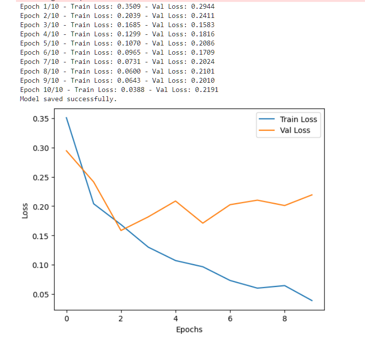

#### Experiment
**Experiment**: SGD with momentum 0.9, and learning rate 0.0001
**Findings**: Prevents overfitting but is slow to converge
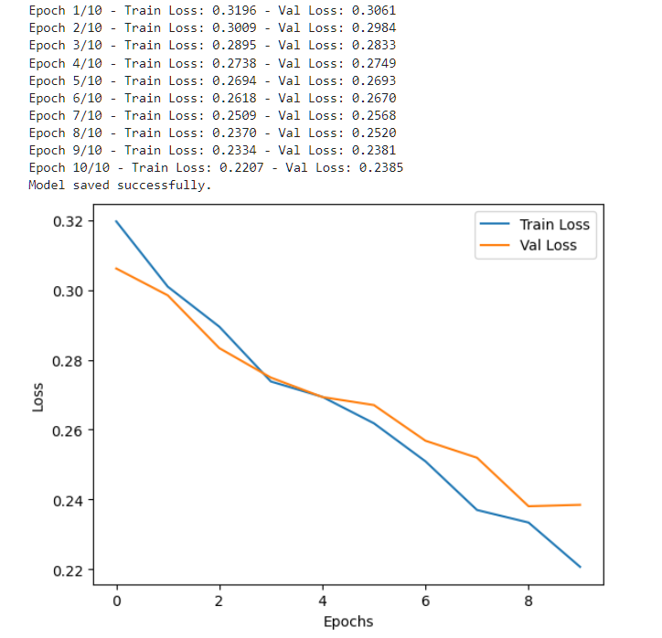

#### Experiment
**Experiment**: Early stopping after 4 epochs with Adam optimizer, and learning rate 0.001
**Findings**: Converges fast and does not overfit
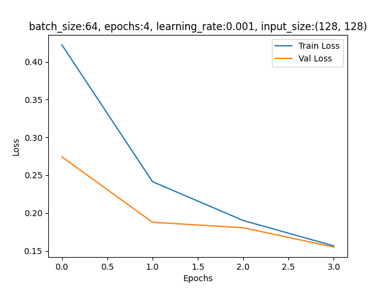

#### Experiment
**Experiment**: Batch size of 32 and 64 with Adam optimizer running for 10 epochs
**Findings**: Batch size of 64 yields better results.
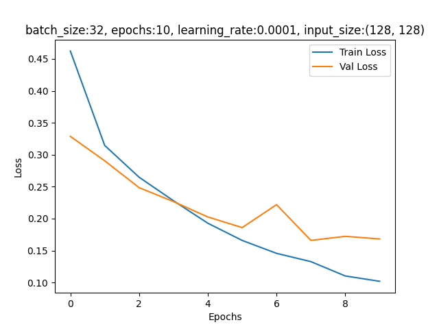
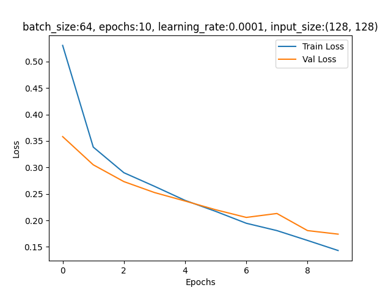


### U-Net Model:
| Parameter       | Values Tried                    |
|----------------|----------------------------------|
| Epochs         | 10, 25                           |
| Batch Size     | 16                               |
| Learning Rate  | 0.0001                           |
| Loss Function  | Binary Cross-Entropy + Dice Loss |

#### Experiment
**Experiment**: Run for 10 and 25 epochs
**Findings**: IoU score and loss were comparable for both, but train time was affected significantly.
- IoU for 25 epochs came to be 93%, and loss was 5%
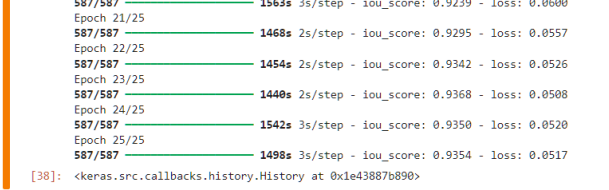
- IoU for 10 epochs came to be 91%, and loss was 6%
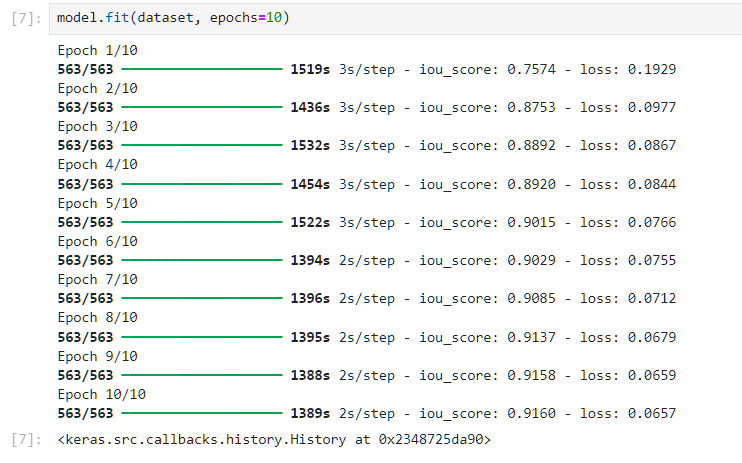

## 📊 Results

| Task                                | Method            | Metric      | Score    |
|-------------------------------------|-------------------|-------------|----------|
| Binary Classification               | SVM               | Accuracy    | 91%      |
|                                     | MLP               | Accuracy    | 89%      |
|                                     | CNN               | Accuracy    | **95%**  |
| Region Segmentation                                     | Canny Edge Detection    | IoU         | 0.34     |
| Mask Segmentation                   | U-Net             | IoU         | **0.92** |


| Model | Epochs | Time Taken      | Dataset                          | Size     |
|-------|--------|----------------|----------------------------------|---------|
| CNN   | 15     | 10 to 20 mins  | Face Mask Detection Dataset     | ~162MB  |
| UNET  | 10     | 4 hours        | Masked Face Segmentation Dataset | ~2.12GB |
| UNET  | 25     | ~12 hours      | Masked Face Segmentation Dataset | ~2.12GB |

### Classification results 
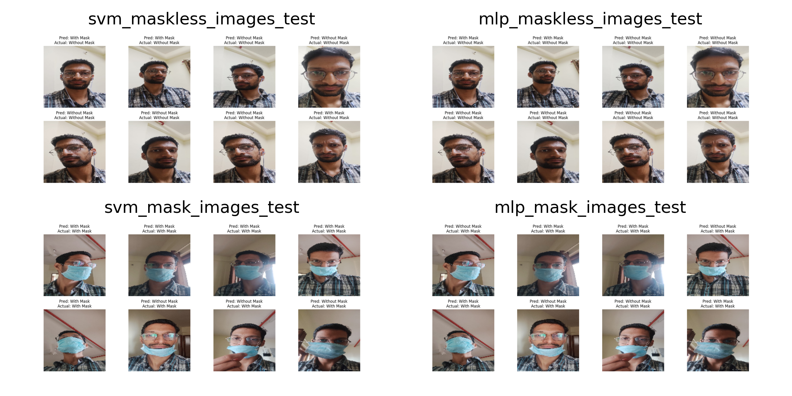

### Traditional Segmentation Results
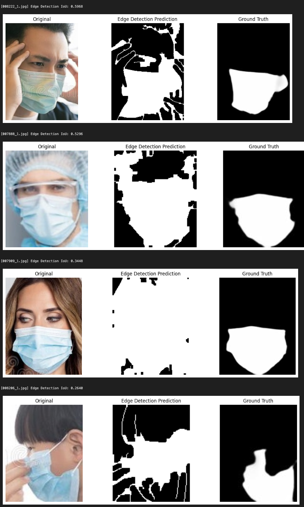

### UNET Segmentation results
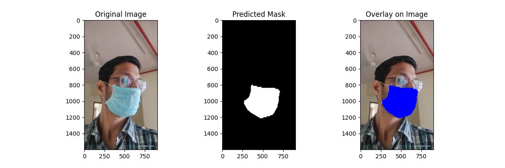
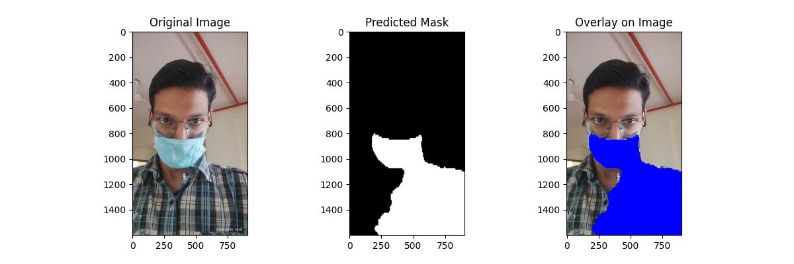
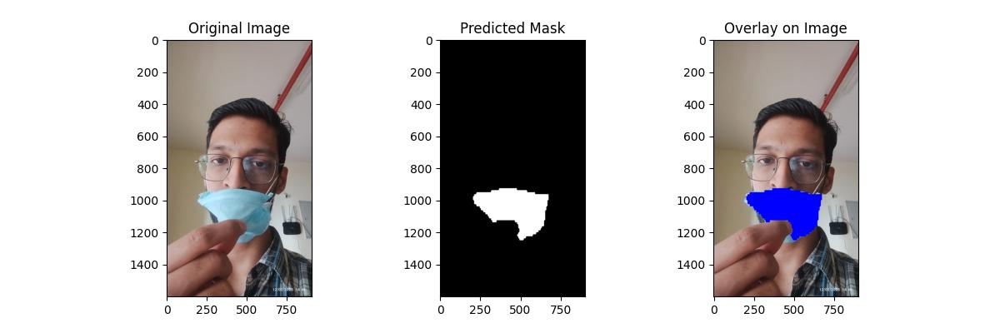
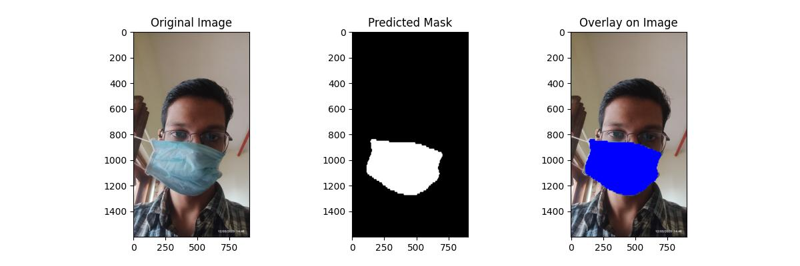


## 🔍 Observations and Analysis
- CNN outperformed classical ML classifiers significantly due to its ability to learn complex features.
- Traditional segmentation techniques provided rough masks but lacked precision.
- U-Net performed extremely well in mask segmentation. On 383 images kept separately for testing, it's IoU is 0.92 compared to just 0.34 from traditional methods.

### **Challenges Faced and Solutions**  

#### **1. Manual Dataset Splitting for CNN**  
The CNN dataset was structured with masked and unmasked images stored in separate folders. This required a **manual split** into training, validation, and test sets to ensure a proper distribution of images across these subsets. To address this, the dataset was **randomly split using a script**, maintaining a balanced class distribution in each subset.  

#### **2. Handling Image Scale Variability in CNN**  
The images in the CNN dataset were of varying resolutions, which could negatively impact model performance. To standardize the input, all images were **resized to a uniform scale** using `torchvision.transforms.Resize()` before being fed into the model. This ensured consistency in feature extraction and improved training stability.  

#### **3. Memory Constraints with UNET Dataset**  
The dataset for UNET exceeded **2GB**, making it impractical to load all images into memory at once. This issue was mitigated by utilizing PyTorch’s **DataLoader**, which loads images in batches rather than all at once. This approach significantly reduced memory consumption while maintaining efficient training by leveraging mini-batch processing.  

### Comparision of Neural Network and SVM for binary classification

**svm-mlp-confusion-matrix**
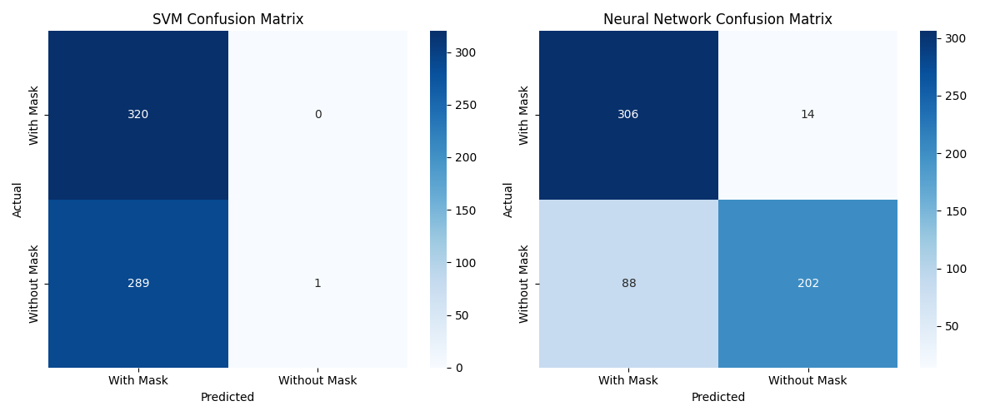

**svm-mlp-precision-recall**
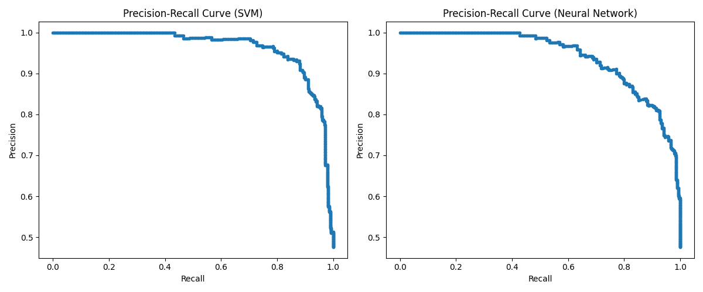

**svm-mlp-roc**
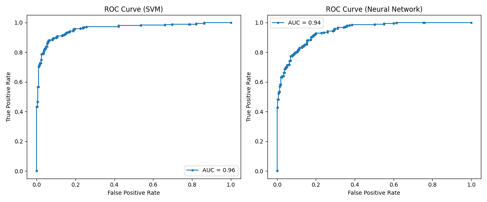

- The precision-recall curve for both models shows that they maintain high precision at high recall values.

- SVM seems to have slightly better precision at high recall values compared to MLP.

- SVM achieves a higher AUC but is heavily biased towards predicting "With Mask". It has high precision for this class but struggles to recognize "Without Mask" images.

- MLP has a slightly lower AUC but provides a more balanced classification, with better recall for "Without Mask".

- If false negatives (missing unmasked faces) are critical, MLP is the better choice.

- If false positives (wrongly classifying unmasked faces as masked) are acceptable, SVM might work better.

### Comparision with Neural Network (MLP)

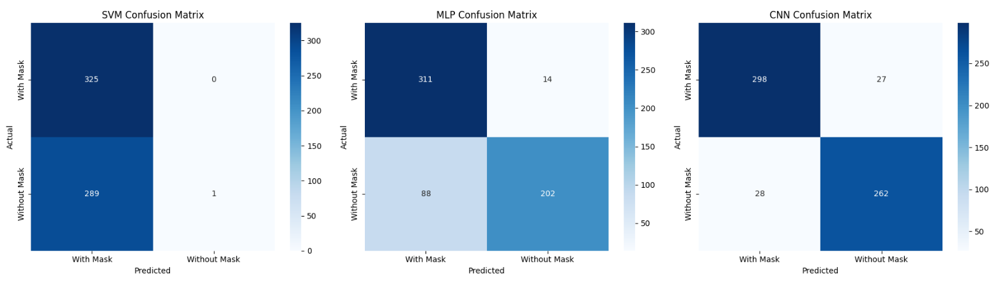

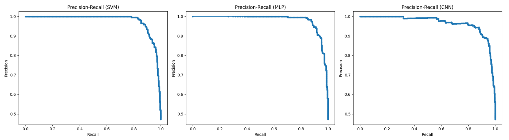
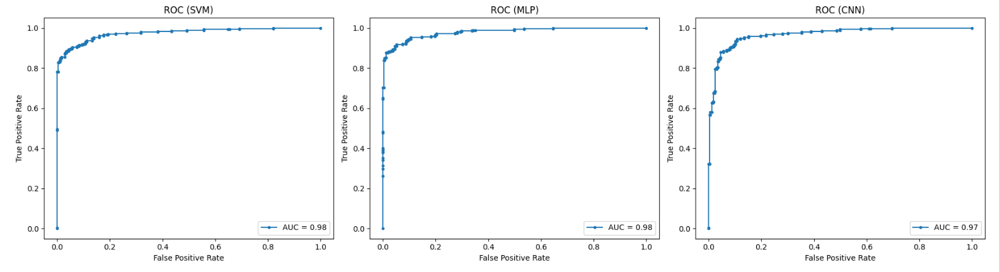

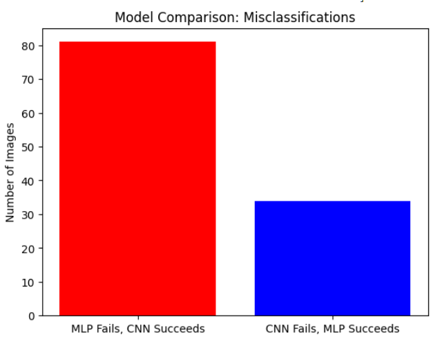

Sample images where MLP (Neural Network) falls short.
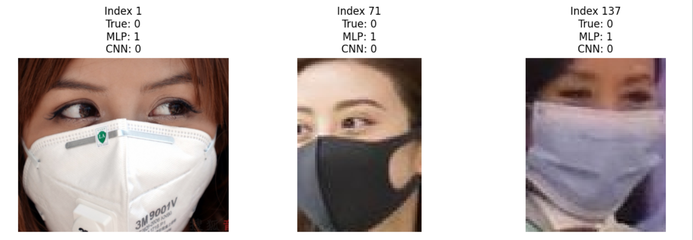


## ▶️ How to Run the Code

`git clone https://github.com/ankit-gahlawat-007/VR_Project1_Ankit_Gahlawat_PH2024002.git`

### 1. Binary Classification (Handcrafted + CNN):
1. Install dependencies
```sh
pip install -r requirements.txt
```
2. Use jupyter notebook (or [Google Colab](https://colab.google.com)) to open the `Image Classification.ipynb` notebook
3. Update path to dataset
4. Run all cells

### 2. Segmentation (Handcrafted + CNN):
1. Install dependencies
```sh
pip install -r requirements.txt
```
2. Download our trained UNET model (~200Mb) from [here](https://drive.google.com/file/d/1zt8MyqLVxG3Unn4sTagGQINInoNIZsIb/view?usp=sharing)
3. Save it in repo's directory (top-level)
4. Open `Image Segmentation.ipynb`
5. Update path to dataset
6. Run code in sections *except for 'UNET Training' section* (because training code takes hours to finish)


